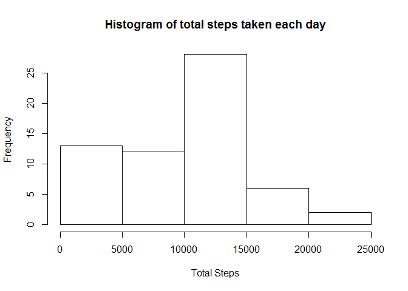
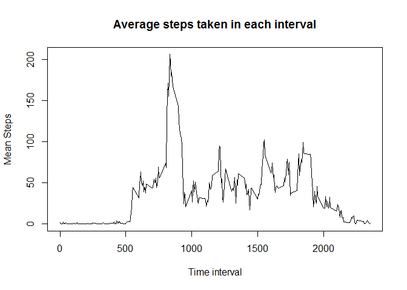
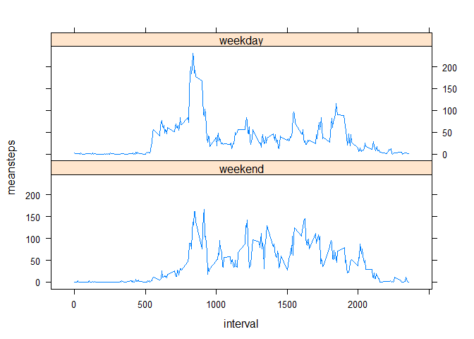

# Peer Assessment 1
mindR  
July 14, 2016  


```r
###reading the data
actdata <- read.csv("activity.csv")
```


```r
library(dplyr)
```

```
## 
## Attaching package: 'dplyr'
```

```
## The following objects are masked from 'package:stats':
## 
##     filter, lag
```

```
## The following objects are masked from 'package:base':
## 
##     intersect, setdiff, setequal, union
```

```r
###Steps per day

StepsPerDay <- actdata %>% group_by(date) %>% summarise(sum(steps, na.rm=TRUE))
colnames(StepsPerDay) <- c("Date", "Steps")

###histogram of steps taken per day
hist(StepsPerDay$Steps, main = "Histogram of total steps taken each day", xlab = "Total Steps", )
```



```r
###calculating mean and meadian value of steps data
actmean <- mean(actdata$steps, na.rm = TRUE)
actmedian <- median(actdata$steps, na.rm = TRUE)
```


```r
###Mean steps for each interval

IntervalData <- actdata %>% group_by(interval) %>% summarise(mean(steps, na.rm=TRUE))
colnames(IntervalData) <- c("Time interval", "Mean Steps")

###Time series plot for the steps data averages across days for each interval

plot(IntervalData, type="l", main="Average steps taken in each interval")
```



```r
###Calculate interval with maximum mean steps

IntervalData[IntervalData$`Mean Steps`==max(IntervalData$`Mean Steps`),]
```

```
## Source: local data frame [1 x 2]
## 
##   Time interval Mean Steps
##           (int)      (dbl)
## 1           835   206.1698
```


```r
###Checking the number of missing values

checkdata <- is.na (actdata$steps)
table(checkdata)
```

```
## checkdata
## FALSE  TRUE 
## 15264  2304
```

```r
###Replacing the NAs with the equivalent mean values for each intervals
###creating a new dataset ModData with replaced values

rep_NA <- function() {
  i <- 0
  tempData <- actdata
    for (i in which(is.na(tempData$steps))) {
        tempData$steps[i] <- IntervalData$`Mean Steps`[which(IntervalData$`Time interval`==tempData$interval[i])]
      }
      tempData
    }

ModData <- rep_NA()

###checking new mean and median values

mean(ModData$steps)
```

```
## [1] 37.3826
```

```r
median(ModData$steps)
```

```
## [1] 0
```


```r
###adding a day column to identify weekdays and weekends

ModData$date <- as.Date(ModData$date)

weekdays1 <- c("Monday", "Tuesday", "Wednesday", "Thursday", "Friday")

ModData$Day <- factor((weekdays(ModData$date) %in% weekdays1), levels = c(FALSE,TRUE), labels = c("weekend", "weekday"))

colnames(ModData) <- c("Steps", "Date", "Interval", "Day")

###plot for average number of steps each day across weekdays and weekends

DayData <- ModData %>% group_by(Interval, Day) %>% summarise(mean(Steps, na.rm=TRUE))

colnames(DayData) <- c("interval", "Day", "meansteps")

###creating the timesharing plot
library(lattice)
xyplot(meansteps ~ interval | Day, data = DayData, type = "l", as.table=TRUE)
```



